# Test element inserting.

The aim of test is to measure performance for two approaches of elements inserting via JS:
1. Insert many elements to DOM one by one.
2. Accumulate a lot of elements in on Document Fragment and then insert them to DOM.

Logic says that second way should have better performance, because DOM is modified once only.
But is there really important difference? Should we remember about it when creating projects?

## How it works

There are two functions. The first function inserts a lot of elements one by one, then the second function accumulates all elements in one document fragment and inserts this fragment to DOM in one operation.

## Testing

For testing I use my Notebook has Intel Core i5 7th Gen and 12GB RAM.

In testing I use JS Date API to measure JS execution time and Chrome Developers tools to measure time that browser spends on rendering.

Of course, measurement results is difference each time, on screenshots above I collected results with numbers that looks like average in my several test executions.

### Test 1

We render with counter + "Lorem ipsum text" as children.

__10 elements__:

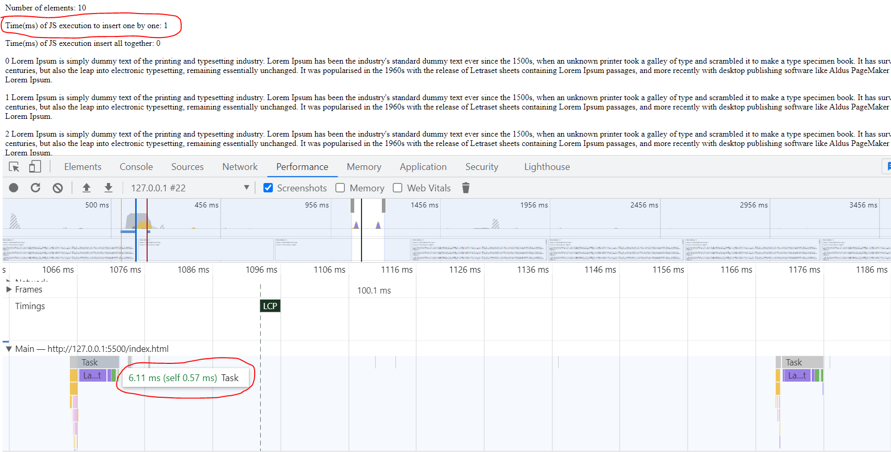
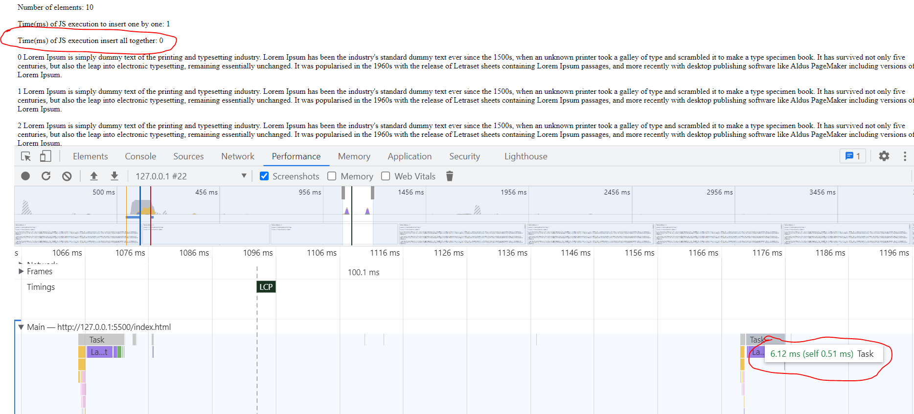

 
 

__100 elements__:

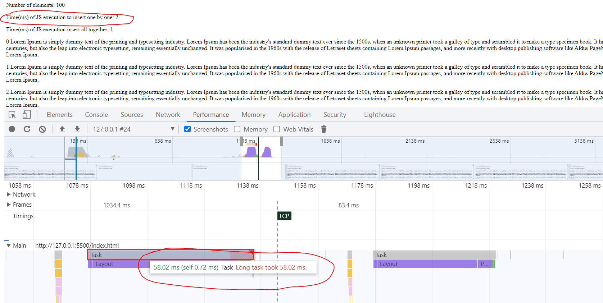
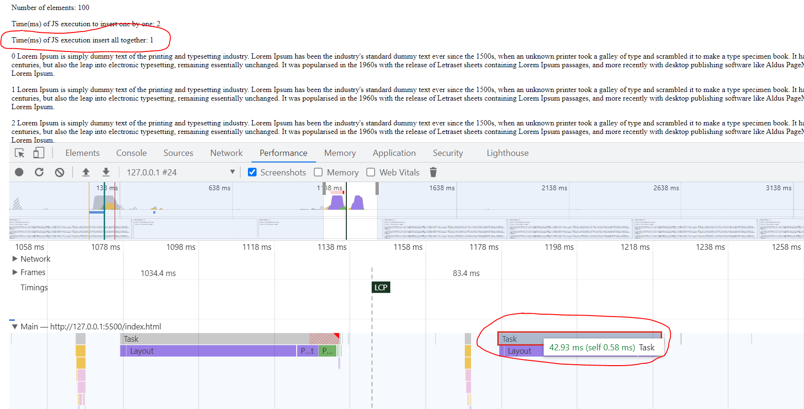

 
 

__1000 elements__:

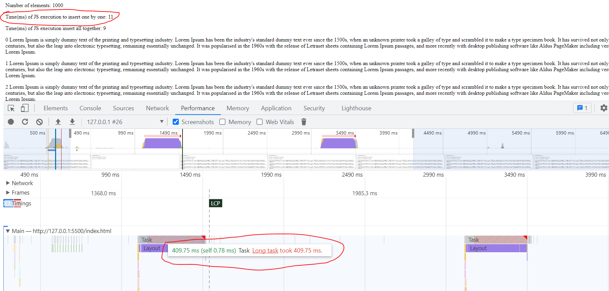
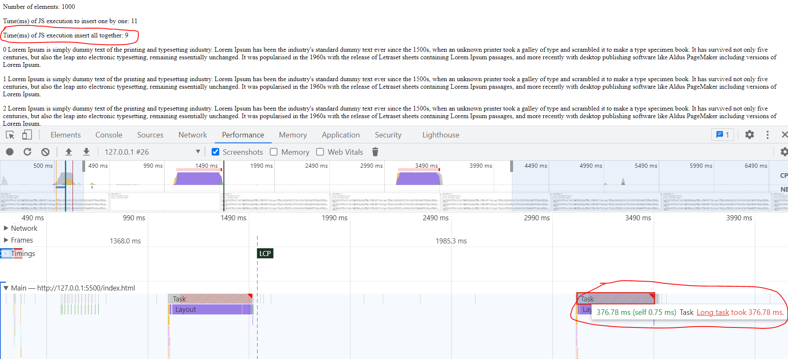

 
 

__10000 elements__:

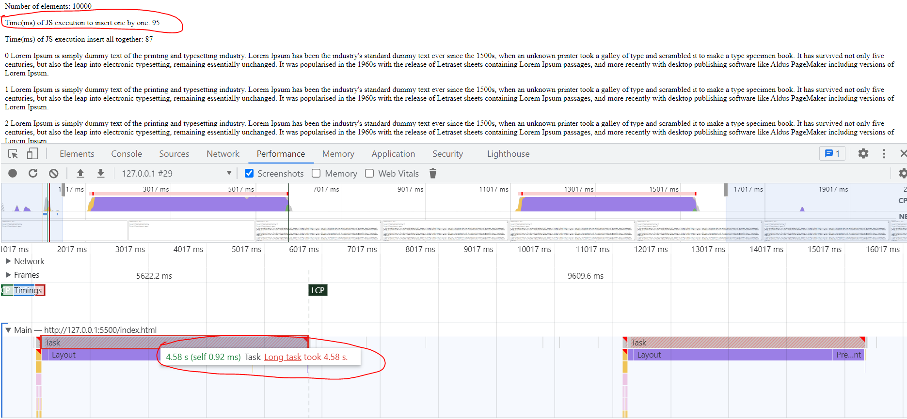
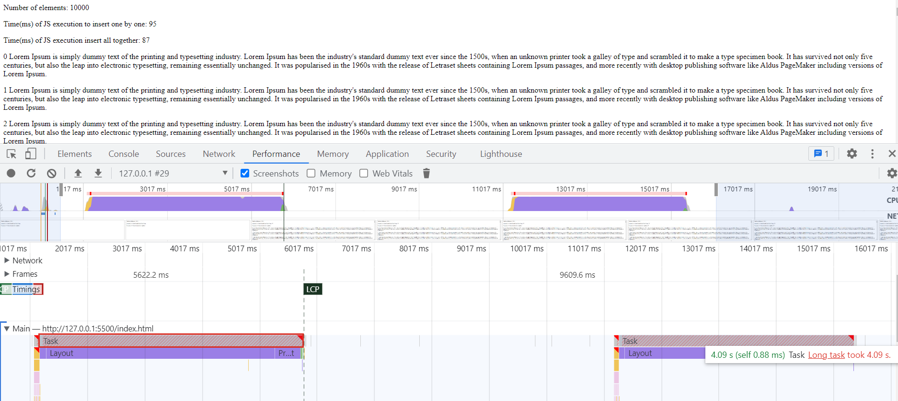

 
 

__50000 elements__:

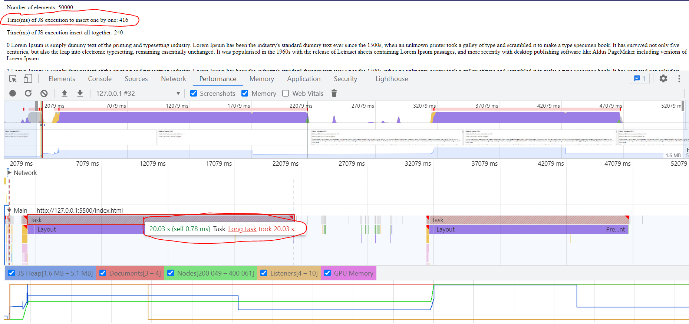
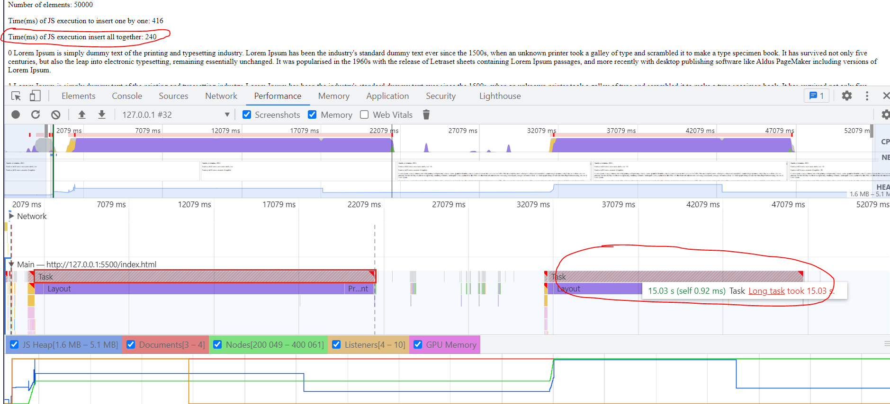

 
 

So, for paragraphs inserting we have such measurements

__JS execution time__ 

|       | insert one by one, ms | insert all together, ms |
|-------|-----------------------|-------------------------|
| 10    | 1                     | 1                       |
| 100   | 2                     | 1                       |
| 1000  | 11                    | 9                       |
| 10000 | 95                    | 87                      |
| 50000 | 416                   | 240                     |

__Rendering in browser time__

|       | insert one by one, ms | insert all together, ms |
|-------|-----------------------|-------------------------|
| 10    | 6.11                  | 6.12                    |
| 100   | 58.02                 | 49.93                   |
| 1000  | 409.75                | 376.78                  |
| 10000 | 4580                  | 4090                    |
| 50000 | 20030                 | 15030                   |

 
 

### Test 2

We render "Lorem ipsum text" + 400x400px image of a dog.

__10 elements__:

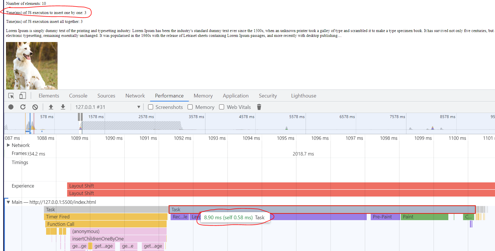
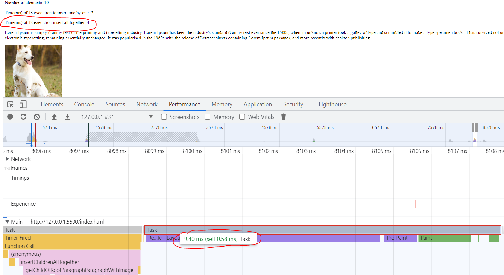

 
 

__100 elements__:

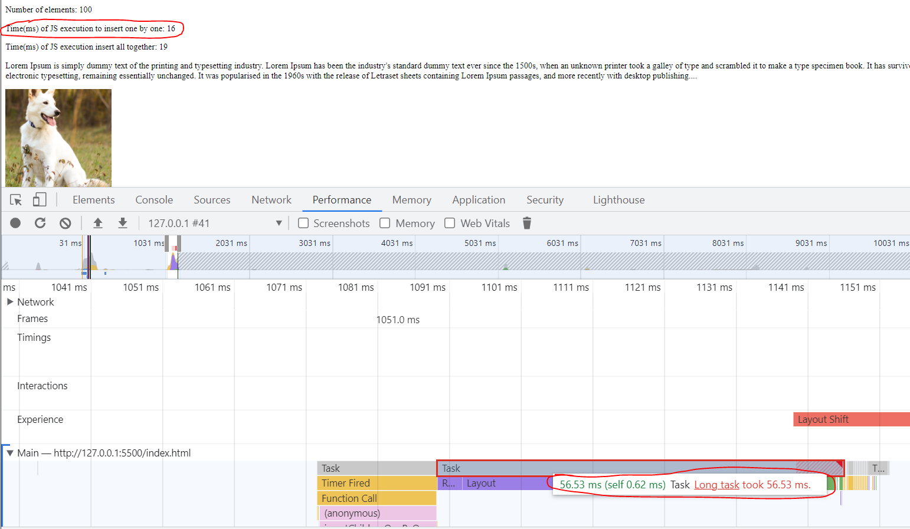
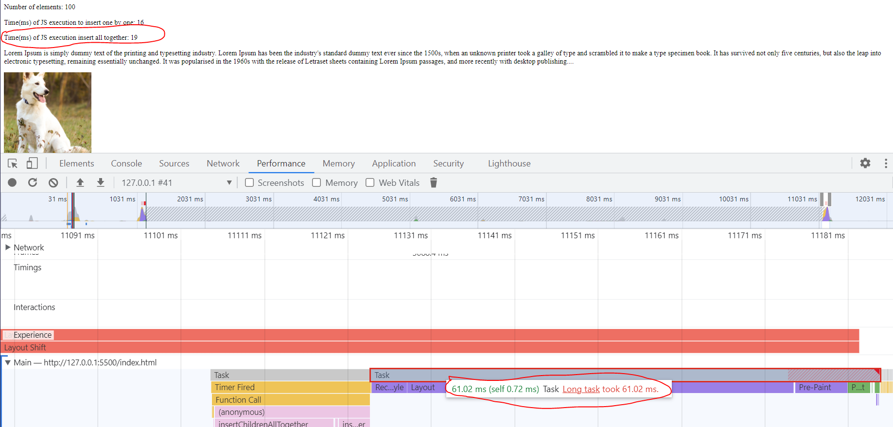

 
 

__1000 elements__:

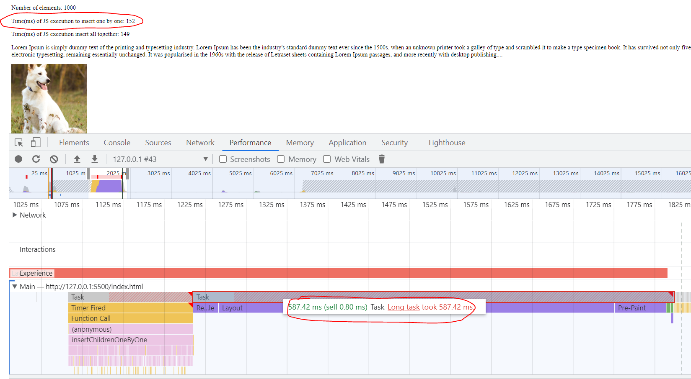
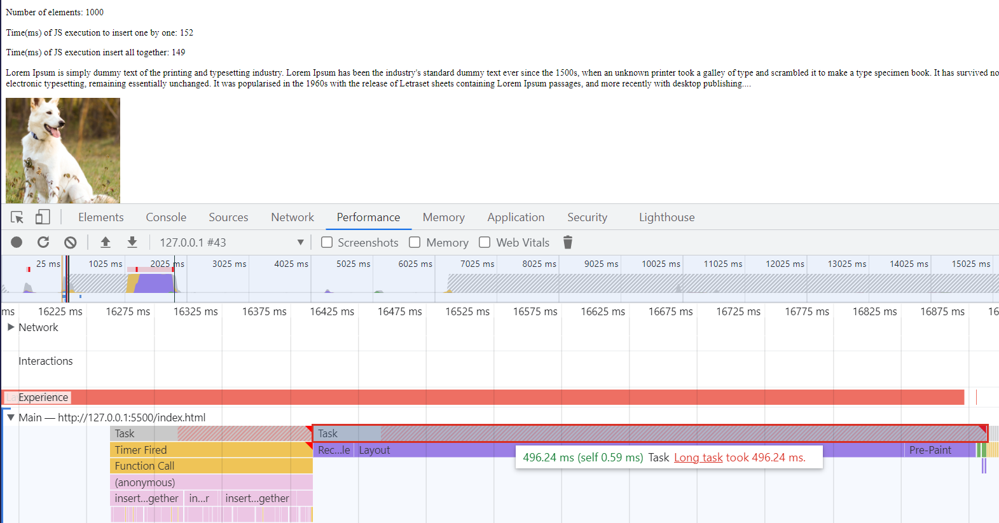

 
 

__10000 elements__:

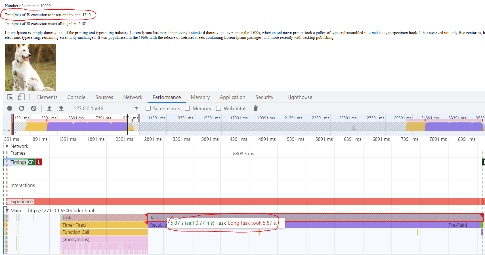
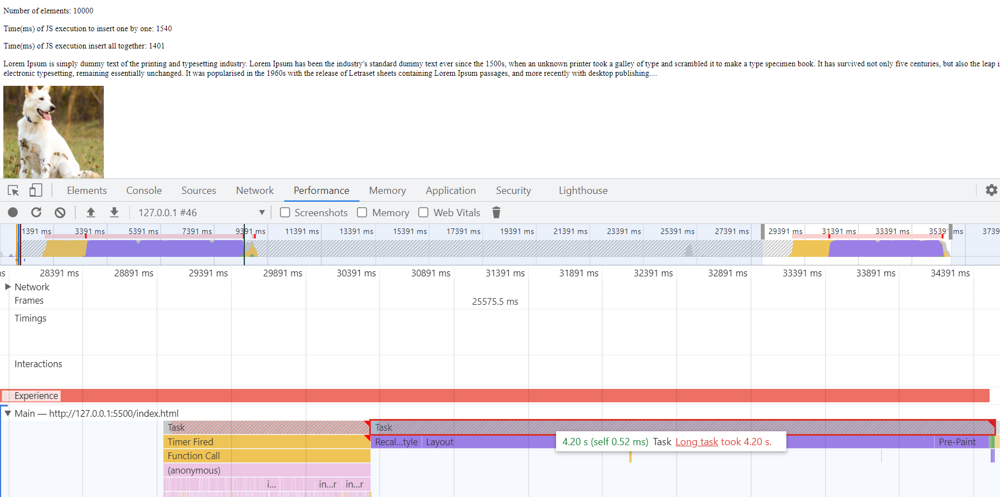

 
 

__50000 elements__:

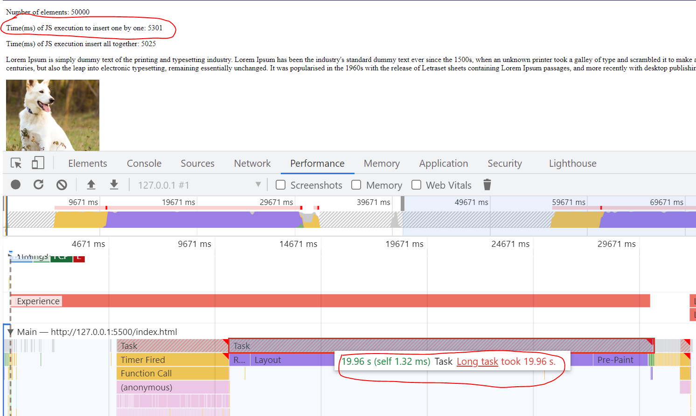
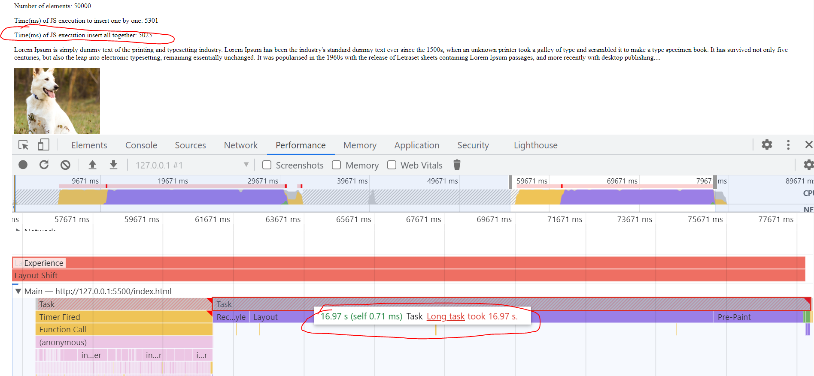

 
 

So, for paragraphs + images inserting we have such measurements

__JS execution time__ 

|       | insert one by one, ms | insert all together, ms |
|-------|-----------------------|-------------------------|
| 10    | 2                     | 4                       |
| 100   | 16                    | 19                      |
| 1000  | 152                   | 149                     |
| 10000 | 1540                  | 1401                    |
| 50000 | 5301                  | 5025                    |

__Rendering in browser time__

|       | insert one by one, ms | insert all together, ms |
|-------|-----------------------|-------------------------|
| 10    | 8.9                   | 9.4                     |
| 100   | 56.53                 | 61.02                   |
| 1000  | 587.42                | 496.24                  |
| 10000 | 5870                  | 4200                    |
| 50000 | 19960                 | 16970                   |

### Total

Two experiments were conducted with inserting elements via JS. 

We see that, on average, inserting all the necessary elements at once turns is a faster way of inserting elements compared to inserting one by one.

But very important not here - the difference is so small that it begins to affect the application only when tens of thousands of elements are inserted.

In our real front-end applications we never(I believe never) insert so many elements. So, looks like in real situation difference is negligently small.

On base of research I can set such a rule for myself: "If there is no difference for you in source code, insert all elements together. If by some reason ( like code readability ) it is better to insert one by one - it is OK, you can do it, there won't be some notable difference."